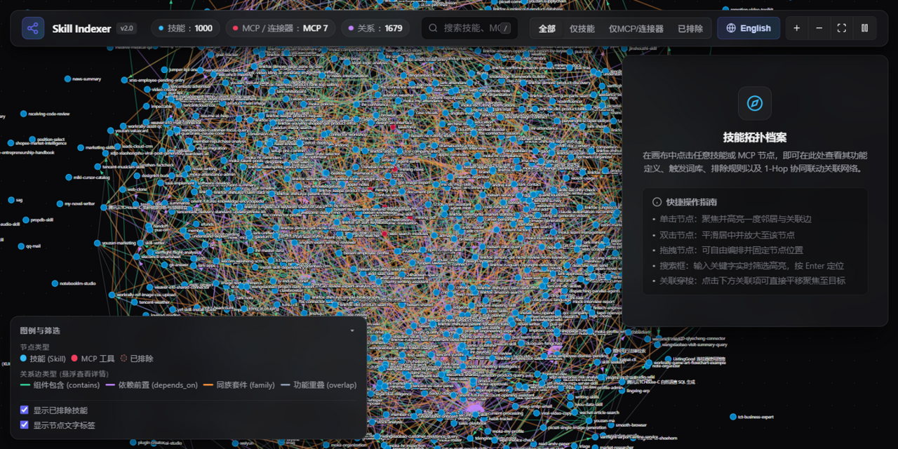

<div align="center">

# skill-indexer

**The local intelligence layer for your agent's skill library — find the right skill, afford the context, chain the workflow.**

[](LICENSE)
[](https://www.python.org)
[](#)
[](#design-principles)

**English** · [简体中文](README_ZH.md)

</div>

---



---

Once an agent's skill library grows past a few dozen skills, three things break:
**selection becomes guesswork**, **context gets eaten alive** (hundreds of SKILL.md
full texts), and **multi-skill tasks have no conductor**.

Installed into a skills directory, `skill-indexer` becomes the agent's **librarian**:
it builds a full-library index and knowledge graph on demand, so the agent can pick
the right skill in milliseconds, chain skills into pipelines along `depends_on`
topology — and your context cost drops from **7,330,470 chars to 167,772
(97.7% saved, 44×)**.

## Install

Drop the repo into any host's skills directory:

```bash
# Claude Code / Claude Desktop
git clone https://github.com/qi-xiao-bai/skill-indexer.git ~/.claude/skills/skill-indexer

# or ~/.cursor/skills, ~/.workbuddy/skills, … or unzip into your platform's skill root
```

That's it. No registration, no config file, no API key.

## Usage

**You talk; the commands are executed by the agent.** This skill ships with an
orchestration contract in its `SKILL.md` (trigger words + intent routing + red-line
rules), so the agent picks and runs the right sub-command by itself:

| You say | Agent runs | You get |
|---|---|---|
| "I have tons of skills — which one fits this task?" | graph Q&A | ranked candidates with hit-evidence terms + related neighbors |
| "Turn this requirement into a pipeline" | topology orchestration | a multi-stage plan layered by the skill graph |
| "What does my skill library cost in context?" | token ledger | compression ratio, startup size, heaviest skills |
| "I just installed a skill, refresh the index" | incremental index | only new/changed entries processed |
| "Is my skill library healthy?" | doctor | bad descriptions, duplicates, broken paths, oversized skills |

A real orchestration exchange (excerpt):

```text
You: write a poem about autumn — I think I have a skill for that?

Agent: (runs pipeline automatically, output excerpt)
  > Basis: retrieval seeds + depends_on topological layering
  > Stage 2: khazix-writer ← evidence: 帮我写、写一
  [skill-indexer] pipeline: [pdf、skill] → [khazix-writer] | graph-topology generated
```

> 💡 You can also use the agent as your operator: ask it to "run a doctor check" or
> "open the dashboard" anytime. All sub-commands live in
> [references/commands.md](references/commands.md) — that file is written **for the
> agent** as its execution manual; humans can read it too.

## What it does

- **📒 Token ledger** — exact full-text vs index cost accounting, with quota-clipping
  and stub-file audits;
- **🕸️ Knowledge graph** — `depends_on` / `contains` / `overlap` / `similar` edges,
  built once, consumed everywhere (`related`, `diff` impact analysis, dashboard,
  orchestration all share one graph);
- **🔗 Topology orchestration** — retrieval seeds → `depends_on` layering → stage
  plan. **Zero hardcoded templates**: when the graph has no dependency edges it says
  so and lists honest parallel candidates instead of forcing a fake pipeline onto
  "write me a poem";
- **🔍 CJK-first retrieval** — Chinese 2/3-gram + capped IDF + maximal-term
  dedup; every hit prints its evidence terms, every ranking is explainable;
- **🩺 Doctor** — CJK-aware thresholds, cross-type duplicate detection, stub-mirror
  detection, optional `--fix` graph repair;
- **📊 Offline dashboard** — pure-local D3 force graph, zero network requests.

## How it works

```text
find ──▶ add ──▶ use ──▶ check        npx skills etc. (distribution: solved)
─────────────────────────────────
index ─▶ audit ─▶ relate ─▶ orchestrate   skill-indexer (the "after install" gap: this repo)
```

The machine reads `skill-index.json` (full-fidelity descriptions + graph edges);
the model reads `skill-index.llms.txt` (one record per line, hard quotas). The first
read command builds the index; everything after is mtime-incremental. Format details:
[references/index-format.md](references/index-format.md).

## Design principles

- **Zero dependencies** — pure Python standard library; 81 tests, CI on Ubuntu +
  Windows;
- **Honest modes** — a metadata-only index says so and refuses to fake compression
  numbers; missing full-text aborts with rc=2 and a recipe;
- **Machine-readable contract** — exit codes `0` ok / `2` expected miss (retry with
  other keywords) / `1` error; `--json` output stays pure JSON;
- **Local by default** — no telemetry, no outbound requests; all writes are atomic.

## Roadmap

- **MCP server wrapper** — expose capabilities as native MCP tools, no shell needed;
- **`npx skills` ecosystem bridge** — read registry-installed libraries out of the box;
- **Semantic retrieval layer** — optional local embeddings over the CJK/IDF core.

## Docs

[Command reference (agent execution manual)](references/commands.md) ·
[Index format](references/index-format.md) ·
[Governance contract](references/governance.md) ·
[Full Chinese manual](使用说明.md)

## Attribution

Original implementation, inspired by (all open-source/MIT, no code copied):
**AOCI** (index format: plain-text cognitive index / fixed field order / hard quotas /
"never copy full text"), **Egonex-AI/Understand-Anything** (stable IDs + persisted
edges + coverage manifest), **rstkit/meta_skill** (FTS retrieval),
**Skills-MCP / meta-mcp / agent-skills-hub / mcp-tool-registry** (discovery patterns).

## License

[MIT](LICENSE)
