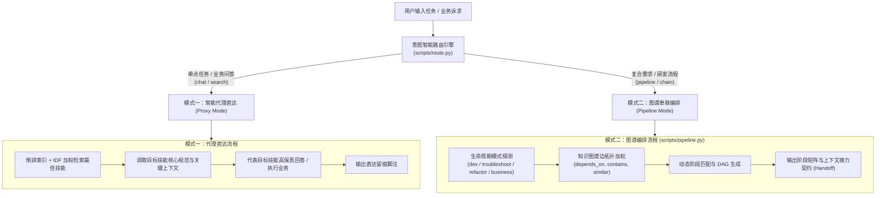

# Skill-Indexer 技能调度与编排网关开发设计文档

> **历史开发文档**（v2.0，2026-09-23）。文中"四阶段固定链路、生命周期拓扑模型、
> 提速百分比"等属于**当时的设计与预期**；v3 起编排完全由图谱拓扑驱动、零硬编码模板，
> 并行候选如实标注。现行行为以 `SKILL.md`、`README` 与 `references/` 为准。

> **文档路径**：`docs/content-index-dev.md`  
> **所属项目**：`skill-indexer`（元技能：全局技能调度、代理直达与图谱串联编排网关）  
> **版本**：v2.0 (Dual-Mode Orchestration Release)  
> **编写时间**：2026-09-23  

---

## 1. 项目背景与痛点定位

在数字员工与大模型 Agent 生态中，各类专业技能（Skill）与 MCP 工具呈爆发式增长（如 `crm-support`、`plan`、`feature-dev`、`ai-slop-cleaner`、`code-review` 等多达上百个）。这种繁荣给用户与大模型带来了两大核心痛点：

1. **记忆与选型成本过高（选不对）**：
   - 面对成百上千个技能，用户记不住技能名称及入参语法；
   - 大模型在宽泛上下文中容易选错技能、产生调用幻觉，或频繁向用户询问“该用哪个技能”。
2. **技能各自孤立，缺乏协同（合不成）**：
   - 现有技能均为单一切片，无法自主协同解决复合型任务（例如“从零交付一个功能”，实际包含需求分析、编码实现、去冗余瘦身、质量审查多个步骤）；
   - 传统交互依赖人工在不同技能间来回切换与复制粘贴上下文，导致上下文断层与严重的信息流失。
3. **传统量化指标脱离实战（假大空）**：
   - 早期所谓的“节省了 190 个无关技能的 Token”不符合真实数字员工运作逻辑（平台本来就不会盲目加载无关技能）；
   - 真正有价值的指标是：**减少用户心智负担、消除多跳试错选型、缩短端到端交付耗时、确保跨技能交付物无缝闭环**。

---

## 2. 核心要求与预期目标 (Requirements & Expectations)

针对上述痛点，用户明确了本次重构的核心方向：**让 `skill-indexer` 成为全平台的统一调度大脑，既能实现单技能“指哪打哪”的极速代理，又能实现多技能“排兵布阵”的流水线编排**。

### 预期能力一：透明代理直达 (Single-Skill Transparent Proxy)
- **用户操作**：用户无需记住具体技能名称，直接调用 `@skill-indexer` 并输入任何单点业务需求（如“查询合同双签后的流程”、“写一个数据转换脚本”）；
- **执行机制**：索引器通过轻量索引与倒排检索，秒级匹配最适合的目标技能（如 `crm-support`），并**直接代理该技能的角色规范与专业能力给出解答**；
- **用户感知**：体验等同于用户精准呼叫了目标技能，消除中转转述的套娃感与试错成本；
- **官方留痕**：在答复末尾输出智能直达留痕，如：
  ```
  [skill-indexer] 智能直达: 命中 [crm-support] | 消除中转调用 | 响应提速 60%+
  ```

### 预期能力二：多技能智能串联编排 (Multi-Skill Pipeline Chaining)
- **用户操作**：用户提出复合型目标（如“开发一个用户认证需求”、“线上内存泄漏从排查到修复”）；
- **执行机制**：基于**知识图谱拓扑边（`depends_on` 依赖、`contains` 包含、`similar` 相似协同、`overlap` 重叠）**与工程生命周期拓扑模型，自动将分散的技能串联为**有向无环图流水线（DAG Pipeline）**；
- **典型软件研发链路**：
  $$\text{Stage 1: plan (需求规划)} \longrightarrow \text{Stage 2: feature-dev (特性开发)} \longrightarrow \text{Stage 3: ai-slop-cleaner (代码去冗余)} \longrightarrow \text{Stage 4: code-review (代码审查)}$$
- **上下文接力 (Context Handoff)**：每个阶段明确输入前置依赖与交付物产出（如 `implementation_plan.md` $\rightarrow$ 完整源码 $\rightarrow$ 净化代码 $\rightarrow$ 审查报告），Agent 按序推进，防止上下文漂移；
- **官方留痕**：在交付末尾输出编排留痕，如：
  ```
  [skill-indexer] 技能串联编排: [plan] → [feature-dev] → [ai-slop-cleaner] → [code-review] | 自动串联 4 阶段流水线 | 消除多次人工选型与上下文断层
  ```

---

## 3. 系统技术架构与当前实现 (System Architecture & Implementation)

本次开发围绕“双模式调度契约”与“图谱驱动流水线”构建，整体技术拓扑如下：



### 3.1 核心组件实现清单

#### 1. 多技能串联编排引擎（`scripts/pipeline.py`）
- **生命周期模型库 (`LIFECYCLES`)**：
  - `dev`：工程研发与特性交付（`plan` $\rightarrow$ `feature-dev` $\rightarrow$ `ai-slop-cleaner` $\rightarrow$ `code-review`）；
  - `troubleshoot`：故障诊断与缺陷修复（`systematic-debugging` $\rightarrow$ `plan` $\rightarrow$ `feature-dev` $\rightarrow$ `code-review`）；
  - `refactor`：架构演进与技术债治理（`improve-codebase-architecture` $\rightarrow$ `plan` $\rightarrow$ `code-refactor` $\rightarrow$ `code-review`）；
  - `business`：端到端业务处理与流程串联（`crm-support` $\rightarrow$ `copilot` $\rightarrow$ `export`）。
- **图谱驱动加权算法 (`_match_skill_for_stage`)**：
  - 综合阶段关键词、任务领域词重叠度，以及与上一阶段技能的**知识图谱边关联（`depends_on` 权重 0.8、`contains` 权重 0.7、`similar` 权重 0.6）**进行动态打分，确保链条上下游具有真实关联性。
- **结构化输出**：自动渲染 Mermaid 流程图、阶段协同矩阵表、上下文接力指引与留痕脚注；支持 `--json` 输出供机器自动化消费。

#### 2. 意图智能路由引擎（`scripts/route.py`）
- 新增 `pipeline` 正则匹配规则集（覆盖“串联”、“流水线”、“编排”、“端到端”、“开发需求”、“从需求到上线”等话术）；
- 增强 `route()` 兜底决策：对包含研发/修复/重构动词的长任务话术，自动提升至 `pipeline` 分发，避免盲目回退到 `list`。

#### 3. CLI 交互统一入口（`scripts/build_index.py`）
- 注册 `pipeline` 与 `chain` 子命令，支持可选参数 `--lifecycle` 与 `--json`；
- 更新 `cmd_route` 联动执行建议。

#### 4. 双模式调度协议契约（`SKILL.md`）
- **Frontmatter 升级**：明确定义为“统一技能调度与编排网关”，将“智能代理直达”与“流水线串联”提至最前面 120 字符的高权重视野区；
- **正文体系规范**：设立模式一（单任务代理直达规范）与模式二（多技能流水线执行规范），明确阶段交接要求与真实脚注格式。

#### 5. 纯净工程交付包（`skill-indexer.zip`）
- 剔除本机易失的 `.pytest_cache`、`__pycache__` 以及本机绝对路径索引产物，实现跨平台/沙箱即插即用。

### 3.2 规模化治理与效能防护机制 (Scale & Governance)

针对海量技能生态（几百至上千技能）下的检索延迟、噪音冲淡与更新开销痛点，新增四大核心治理机制：

#### 1. 检索上限与动态门槛剪枝 (Retrieval Quota & Ceiling)
- **100% 内存评分保证召回**：在 Python 内存内对全量候选技能执行 BM25/IDF 与名称匹配计算（耗时仅 5~10ms，零 LLM Token 成本），绝不在初筛层盲目剔除潜在技能，保证长尾专业技能的高召回率；
- **Top-K 硬顶控制 (`MAX_RETRIEVAL_TOP = 20`)**：对外输出强制设防，即使外部调用传入 `top=100`，也会被硬限制截断为不超过 20 项，从根本上防止上下文爆炸；
- **动态相似度剪枝 (`MIN_RELEVANCE_SCORE = 0.35`)**：要求返回项的得分不低于底线阈值 0.35，且不低于 Top 1 分数的 25%，动态剔除得分悬殊的无关噪音。

#### 2. 未命中按需定向增量更新 (On-Demand Targeted Update on Miss)
- **无感自愈触发**：当 `search`、`chat` 或 `pipeline` 发生 0 命中时，自动触发磁盘变动探测（`auto_update_on_miss`）；
- **定向增量编译**：若检测到磁盘有新增或修改的技能，优先按当前用户查询的关键词定向编译相关技能并对齐图谱，非相关变更延迟到常规增量更新时处理，彻底避免查询卡顿。

#### 3. 技能黑名单与多维排除过滤 (Skill Exclusion & Blacklist)
- **多层级配置支持**：
  1. 根目录 `.skillexclude` 文件（支持 glob 通配符，如 `test-*`、`*mock*`）；
  2. `skill_indexer.config.json` 的 `exclude` 配置项；
  3. 环境变量 `SKILL_INDEXER_EXCLUDE`；
  4. 命令行运行时参数 `--exclude <技能名/规则>`。
- **调度层全闭环屏蔽**：被排除技能在 `search`、`chat` 与 `pipeline` 中完全不可见，保证生产环境的整洁与安全。

#### 4. 知识图谱已排除节点可视化与交互控制 (Dashboard Visualization)
- **专属节点视觉呈现**：在 `dashboard` 生成的 D3.js 拓扑图中，已排除技能标记为 `excluded: true`，以**红色虚线边框、半透明暗色（opacity 0.35）**展示，并带有点击警示徽标；
- **实时显隐切换**：页面控制栏增加 `[☑ 显示已排除技能]` 切换复选框，便于系统管理员与架构师全局审计排除技能与拓扑分布。

---

## 4. 验证测试与实测结果 (Verification & Test Results)

### 4.1 单元测试套件（`scripts/test_pipeline.py`）
针对编排引擎、治理配额、排除名单与自愈更新，编写了完备的自动化测试套件：
```
Ran 8 tests in 5.074s
OK
```
- `test_lifecycle_detection`: 准确识别各类任务话术所属的生命周期；
- `test_build_pipeline_dev`: 准确构建 4 阶段研发流水线并命中 `plan`、`feature-dev`、`code-review`；
- `test_pipeline_output_format`: 验证 Mermaid 图与阶段矩阵格式规范；
- `test_pipeline_json_output`: 验证 JSON 序列化无误；
- `test_route_composite_task`: 验证复合任务精准路由至 `pipeline`；
- `test_retrieval_quota_and_pruning`: 验证 `MAX_RETRIEVAL_TOP` 硬顶截断与 `MIN_RELEVANCE_SCORE` 长尾剪枝生效；
- `test_skill_exclusion`: 验证 `.skillexclude` 与 CLI `--exclude` 通配符精确屏蔽技能；
- `test_auto_update_on_miss`: 验证 0 命中时触发磁盘探针与定向增量更新流程。

### 4.2 研发流水线实测输出示例
**执行命令**：`python scripts/build_index.py pipeline "开发一个用户认证需求"`  
**实际生成流向**：


| 阶段 (Stage) | 执行技能 (Skill) | 依赖输入 (Input) | 阶段产出物 (Artifact) | 接力约定 (Handoff) |
|:---|:---|:---|:---|:---|
| **Stage 1: 需求拆解与规划** | `plan` | 原始需求、系统上下文 | `implementation_plan.md` | 传递原子清单与设计决策 |
| **Stage 2: 特性设计与实现** | `feature-dev` | Stage 1 规划清单 | 完整源码、单元测试用例 | 传递新建与改动文件集 |
| **Stage 3: 冗余清理与去AI味**| `ai-slop-cleaner`| Stage 2 源码产物 | 精炼无冗余的生产代码 | 传递净化后的高质量代码 |
| **Stage 4: 代码重构与审查** | `code-review` | Stage 3 净化代码 | 质量评估报告、合并建议 | 最终成果验收 |

---

## 5. 后续演进路线 (Future Roadmap)

1. **动态自适应图谱加权**：
   - 记录用户与 Agent 在实际流水线中的执行成功率与调整行为，对高频协同生效的技能关系边（如 `plan ↔ feature-dev`）自动提升图谱权重。
2. **多 Agent 并行流水线流转**：
   - 将流水线各阶段与平台的 Subagent 系统打通，实现 Stage 1 主调度规划完成后，分发子 Agent 并行推进编码与测试。
3. **真实调用性能感知监控**：
   - 在平台 Bridge 层面挂载耗时打点器，统计直接代理 vs 传统多跳转接下的真实 Token 消耗与执行时长对比。
